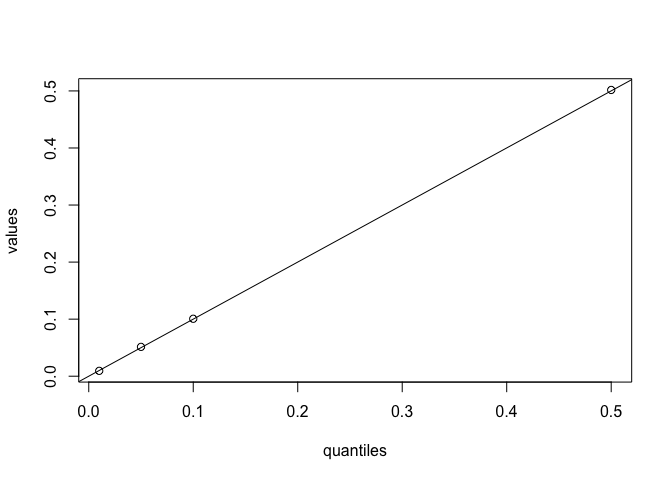
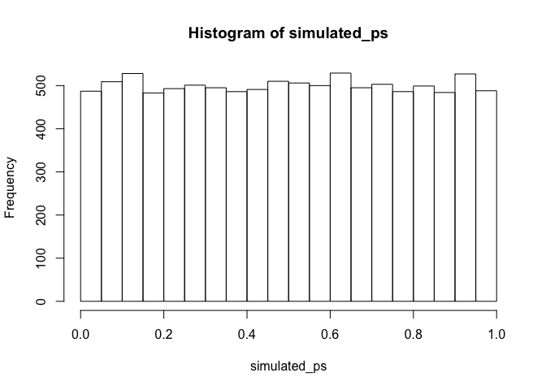

Estimating false positive rates with simulation
================
Joel Levin
April 12, 2020

This version: 2020-04-12 12:25:09.  
You can contact Joel at <joelmlevin@gmail.com>.

## Description

This is a script to test the true false positive rate of any statistical
test that one is using to evaluate experimental results. The motivation
to conduct this test came from [this working
paper](https://psyarxiv.com/cyv6d/) by Ryan, Evers, & Moore (2018). I
used this stimulation to estimate the false positive rate of a poisson
regression, but it can be used to evaluate any test.

## Basic functions

This function generates a single vector containing p values of a test
with random experimental conditions. If a statistical test is behaving
properly, p values of a given magnitude (e.g., .05) should appear with a
corresponding frequency (e.g., 5% of the time). The arguments include:

1.  `outcome_vector`: the real vector of dependent measures from your
    study. this should be a numerical vector.
2.  `num_conditions`: the number of experimental conditions in your
    study.
3.  `test_type`: the statistical test used. this currently supports
    `"poisson", "ols", "t-test"`.
4.  `replications`: the number of tests to simulate. this defaults to
    10,000 tests, which is usually sufficient. if you’re not in a hurry
    and have a modern-ish machine, make it
100,000.

<!-- end list -->

``` r
simulate_fp <- function(outcome_vector, num_conditions = 2, test_type = c("poisson", "ols", "t-test"), replications = 10000) {
  
  tests <- rep(NA, replications) # generate an empty vector of appropriate length. this will be overwritten with p values
  
  # looping to fill in each element of the `tests` vector
  for(n in 1:replications) {
    false_condition <- sample(c(1, num_conditions), length(outcome_vector), replace = TRUE) # generating a vector of random condition dummies

    # conducting the tests    
    if(test_type == "poisson") {
    tests[n] <-  coef(summary(glm(outcome_vector ~ false_condition, family = poisson)))[2, 1:4][4]
    }
    if(test_type == "ols") {
      tests[n] <-  coef(summary(lm(outcome_vector ~ false_condition)))[2, 1:4][4]
    }
    if(test_type == "t-test") {
      tests[n] <-  t.test(outcome_vector ~ false_condition)$p.value
    }
  }
  return(tests)
}
```

This function takes the output of the previous function and returns a
diagnostic table or plot, which indicates whether p values appear as
frequently as expected for a well-behaving test. The arguments include:

1.  `data`: this should be a vector of simulated p values, such as those
    provided using the above function.
2.  `type`: this indicates whether to output a table of values or a
    plot. see below for examples.
3.  `quantiles`: a vector of percentiles at which to compare the
    simulated p values to their observed frequency. this argument is
    prespecified at recommended values and is therefore
optional.

<!-- end list -->

``` r
diagnostics <- function(data, type = c("table", "plot"), quantiles = c(.01, .05, .10, .5)) {
  comparitors <- round(quantile(data, quantiles), 4)
  temp <- cbind(quantiles, comparitors)
  
    if(type == "table") {
      return(temp)
      }

    if(type == "plot") {
    plot(temp)
    abline(0, 1)
    }
}
```

## Using the functions

Generating a “real” set of experimental conditions. In practice, this
would be the actual vector of experimental conditions in your study.

``` r
real_conditions <- sample(c(1, 2), 100, replace = TRUE)
```

Generating a “real” set of dependent measures (continuous). In practice,
this would be the actual vector of dependent measures in your study.

``` r
real_dv <- rnorm(100, 20, 10)
```

Conducting a t test on the “real” data.

``` r
t.test(real_dv ~ real_conditions)
```

    ## 
    ##  Welch Two Sample t-test
    ## 
    ## data:  real_dv by real_conditions
    ## t = 0.13339, df = 96.952, p-value = 0.8942
    ## alternative hypothesis: true difference in means is not equal to 0
    ## 95 percent confidence interval:
    ##  -3.596231  4.114463
    ## sample estimates:
    ## mean in group 1 mean in group 2 
    ##        20.38756        20.12844

Now using the function to simulate p values for random experimental
conditions

``` r
simulated_ps <- simulate_fp(outcome_vector = real_dv, num_conditions = 2, 
                            test_type = "t-test", replications = 10000)

simulated_ps[1:10]
```

    ##  [1] 0.9728038 0.6012338 0.3861158 0.2213838 0.7933293 0.8322469 0.2687333
    ##  [8] 0.7213555 0.6033797 0.6076678

### Now using the diagnostic functions.

The diagnostic table gives shows you the p values (comparitors) at
various percentiles (quantiles). The closer the two are, the better the
test is behaving. Note that this is also affected by the number of
replications used to generate the simulated data.

``` r
diagnostics(simulated_ps, type = "table")
```

    ##     quantiles comparitors
    ## 1%       0.01      0.0091
    ## 5%       0.05      0.0491
    ## 10%      0.10      0.0944
    ## 50%      0.50      0.4998

The diagnostic plot simply combines both values in a plot with a
reference line. The closer the points are to the reference line, the
better behaved the test.

``` r
diagnostics(simulated_ps, type = "plot")
```

<!-- -->

We can also conduct a test to more rigorously evaluate whether our
statistical test is well behaved. The below function was written by
[Eric Archer](mailto:eric.archer@noaa.gov) for the `swfscMisc` package.
It is included in the text of this script to minimize dependencies.

``` r
uniform.test <- function(hist.output, B = NULL) {
  break.diff <- diff(hist.output$breaks)
  probs <- break.diff / sum(break.diff)
  if (is.null(B)) {
    chisq.test(x = hist.output$counts, p = probs)
  } else {
    chisq.test(x = hist.output$counts, p = probs, simulate.p.value = TRUE, B = B)
  }
}
```

This function returns a chi squared statistic that, if significant,
tells us that our data are *not* uniform, meaning that the p values
cannot be interpreted conventionally. The large p-value here tells us
that we’re fine.

``` r
uniform.test(hist(simulated_ps))
```

<!-- -->

    ## 
    ##  Chi-squared test for given probabilities
    ## 
    ## data:  hist.output$counts
    ## X-squared = 19.296, df = 19, p-value = 0.438

(Later, add in the plotting functions)
