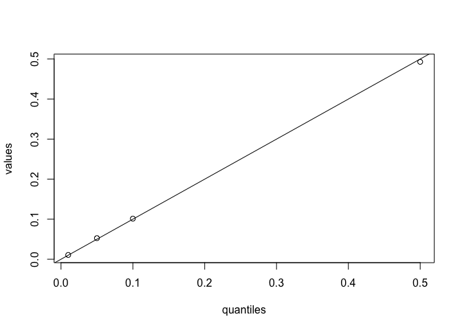

Estimating false positive rates with simulation
================
Joel Levin
April 12, 2020

This version: 2020-04-13 09:13:56.  
You can contact Joel at <joelmlevin@gmail.com>.

## Description

This is a script to evaluate the false positive rate of a statistical
test. In its current form, it is designed for experimental tests, but it
can be easily adapted to evaluate any test. The motivation to conduct
this test came from [this working paper](https://psyarxiv.com/cyv6d/) by
Ryan, Evers, & Moore (2018). I used this stimulation to estimate the
false positive rate of a poisson regression,as suggested by Ryan et al.,
but it can be used to evaluate any test.

The intuition behind this test is as follows: when we read a p value
associated with an experimental test, we interpret it as the probability
of a false positive – i.e., the probability of observing an effect at
least as large if our manipulation had no true effect. For some tests,
the p value does not correspond directly to the true false positive
rate, which presents a problem for those who wish to interpret it.
Statistical explanatios this phenomenon are beyond the scope of this
document, but it’s worth noting that the probability of a false positive
can vary as a function of the distributional form of the test’s
dependent measure. Fortunately, the false positive rate of any test can
be made in to a relatively simple empirical question.

To evaluate a test’s false positive rate, you can simply run your test a
bunch of times using your real dependent data but randomized
experimental conditions. Then, to estimate your false positive rate, you
can count how many of those tests are statistically significant. To
adjust your observed p value to account for this false positive rate,
you can count how many tests have p values at least as small as your
observed p value.

## What an inflated false positive rate looks like

The below figure was generated using data from one of my projects. We
conducted an experiment in which the dependent measure was a count
between 0 and 3. The statistical test that we preregistered was a
poisson regression, and the test yielded a p value of 0.027. Using the
function that I describe below, we simulated both the false positive
rate (10.4%) and the rate at which we observed p values at least as
small as our own (6.6%). You can see the code that was used to generate
this graph in the file `false_positives.R`, in this repo.

<!-- -->

## Basic functions

This function generates a single vector containing p values of a test
with random experimental conditions. If a statistical test is behaving
properly, p values of a given magnitude (e.g., .05) should appear with a
corresponding frequency (e.g., 5% of the time). The arguments include:

1.  `outcome_vector`: the real vector of dependent measures from your
    study. this should be a numerical vector.
2.  `num_conditions`: the number of experimental conditions in your
    study.
3.  `test_type`: the statistical test used. this currently supports
    `"poisson", "ols", "t-test"`.
4.  `replications`: the number of tests to simulate. this defaults to
    10,000 tests, which is usually sufficient. if you’re not in a hurry
    and have a modern-ish machine, make it
100,000.

<!-- end list -->

``` r
simulate_fp <- function(outcome_vector, num_conditions, test_type = c("poisson", "ols", "t-test"), replications = 10000) {
  
  # tests
  if(test_type != "poisson" & test_type != "ols" & test_type != "t-test") { # test type must conform to available types
    stop("Please specify a test type using the `test_type` argument. The available tests are 'poisson', 'ols', and 't-test.")
    }
  if(is.numeric(outcome_vector != TRUE)) { # outcome vector must be numeric
    stop("outcome_vector must be a numeric vector.")
    }
  if(all.equal(num_conditions, as.integer(num_conditions)) != TRUE | num_conditions < 1) { # must be an integer greater than 1
    stop("Please specify the number of conditions in your study using the num_conditions argument.")
    }
  
  tests <- rep(NA, replications) # generate an empty vector of appropriate length. this will be overwritten with p values
  
  # looping to fill in each element of the `tests` vector
  for(n in 1:replications) {
    false_condition <- sample(c(1, num_conditions), length(outcome_vector), replace = TRUE) # generating a vector of random condition dummies

    # conducting the tests    
    if(test_type == "poisson") {
    tests[n] <-  coef(summary(glm(outcome_vector ~ false_condition, family = poisson)))[2, 1:4][4]
    } 
    if(test_type == "ols") {
      tests[n] <-  coef(summary(lm(outcome_vector ~ false_condition)))[2, 1:4][4]
    }
    if(test_type == "t-test") {
      tests[n] <-  t.test(outcome_vector ~ false_condition)$p.value
    }
  }
  return(tests)
}
```

This function takes the output of the previous function and returns a
diagnostic table or plot, which indicates whether p values appear as
frequently as expected for a well-behaving test. The arguments include:

1.  `data`: this should be a vector of simulated p values, such as those
    provided using the above function.
2.  `type`: this indicates whether to output a table of values or a
    plot. see below for examples.
3.  `quantiles`: a vector of percentiles at which to compare the
    simulated p values to their observed frequency. this argument is
    prespecified at recommended values and is therefore
optional.

<!-- end list -->

``` r
diagnostics <- function(data, type = c("table", "plot"), quantiles = c(.01, .05, .10, .5)) {
  values <- round(quantile(data, quantiles), 4)
  difference <- abs(quantiles - values)
  temp <- cbind(quantiles, values, difference)
  
    if(type == "table") {
      return(temp)
      }

    if(type == "plot") {
    plot(temp)
    abline(0, 1)
    }
}
```

## Using the functions

Generating a “real” set of experimental conditions. In practice, this
would be the actual vector of experimental conditions in your study.

``` r
real_conditions <- sample(c(1, 2), 100, replace = TRUE)
```

Generating a “real” set of dependent measures (continuous). In practice,
this would be the actual vector of dependent measures in your study.

``` r
real_dv <- rnorm(100, 20, 10)
```

Conducting a t test on the “real” data.

``` r
t.test(real_dv ~ real_conditions)
```

    ## 
    ##  Welch Two Sample t-test
    ## 
    ## data:  real_dv by real_conditions
    ## t = 0.19869, df = 93.836, p-value = 0.8429
    ## alternative hypothesis: true difference in means is not equal to 0
    ## 95 percent confidence interval:
    ##  -3.280400  4.009935
    ## sample estimates:
    ## mean in group 1 mean in group 2 
    ##        20.54685        20.18208

Now using the function to simulate p values for random experimental
conditions

``` r
simulated_ps <- simulate_fp(outcome_vector = real_dv, num_conditions = 2, test_type = "t-test", replications = 10000)

simulated_ps[1:10]
```

    ##  [1] 0.6662975 0.9669222 0.4740433 0.6105617 0.8162617 0.6514470 0.3298478
    ##  [8] 0.8846670 0.2634358 0.1951311

### Now using the diagnostic functions.

The diagnostic table gives shows you the p values (values) at various
percentiles (quantiles). The closer the two are, the better the test is
behaving. Note that this is also affected by the number of replications
used to generate the simulated data.

``` r
diagnostics(simulated_ps, type = "table")
```

    ##     quantiles values difference
    ## 1%       0.01 0.0107     0.0007
    ## 5%       0.05 0.0527     0.0027
    ## 10%      0.10 0.1014     0.0014
    ## 50%      0.50 0.4929     0.0071

The diagnostic plot simply combines both values in a plot with a
reference line. The closer the points are to the reference line, the
better behaved the test.

``` r
diagnostics(simulated_ps, type = "plot")
```

<!-- -->

We can also conduct a test to more rigorously evaluate whether our
statistical test is well behaved. The below function was written by
[Eric Archer](mailto:eric.archer@noaa.gov) for the `swfscMisc` package.
It is included in the text of this script to minimize dependencies.

``` r
uniform.test <- function(hist.output, B = NULL) {
  break.diff <- diff(hist.output$breaks)
  probs <- break.diff / sum(break.diff)
  if (is.null(B)) {
    chisq.test(x = hist.output$counts, p = probs)
  } else {
    chisq.test(x = hist.output$counts, p = probs, simulate.p.value = TRUE, B = B)
  }
}
```

This function returns a chi squared statistic that, if significant,
tells us that our data are *not* uniform, meaning that the p values
cannot be interpreted conventionally. The large p-value here tells us
that we’re fine.

``` r
uniform.test(hist(simulated_ps))
```

<!-- -->

    ## 
    ##  Chi-squared test for given probabilities
    ## 
    ## data:  hist.output$counts
    ## X-squared = 12.056, df = 19, p-value = 0.8832

(Later, add in the plotting functions)
